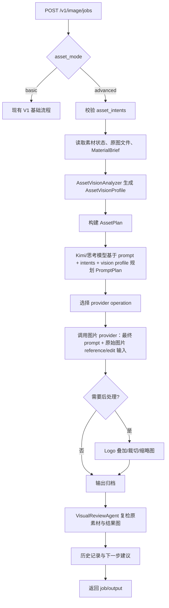

# 24. V1 素材高级版开发文档

## 1. 背景

V1 生图当前已经预留了素材上传入口，但上传素材在后端还没有形成可控的“用途语义”。用户上传的图片可能是风格参考、商品参考、Logo、人物脸、背景、构图，也可能只是临时灵感图。如果后端只把 `asset_ids` 原样传给生图链路，模型很难稳定理解用户真实意图，尤其在没有 Claude 中枢大脑参与的 V1 场景里，结果会不可控。

因此 V1 的素材能力拆成两个执行路径。产品体验上它们是协作叠加关系：

- `基础版`：数量、画幅、格式、质量、工作强度、模型选择等基础参数始终生效。
- `高级版`：在基础参数之上叠加图片素材增强。用户必须显式选择素材用途，后端根据结构化用途做确定性校验、路由、提示词拼装、provider 能力选择和后处理。

当前落地阶段，高级版只支持图片素材。PDF、PPT、DOC、表格等多模态素材仍属于后续完整素材解析能力，不进入 V1 高级版的参考图链路。

本文件只定义 V1 高级版的后端设计。V1 的思考流程使用当前已配置的思考模型，默认可走 Kimi/Anthropic-compatible 通道；V2 以后可让 Claude Code 中枢承担更复杂的自动理解与调度。

关键原则：

- Kimi/思考模型负责“规划如何使用素材”，不是唯一的图片记忆载体。
- 上传图片必须通过 `image_reference` / `image_edit` 等图片输入通道进入 gpt-image-2 或等效图片 provider；只把图片内容改写成提示词是不够的。
- 视觉理解层负责把图片转成结构化 `AssetVisionProfile`，供 Kimi/思考模型做高质量规划。
- 视觉复检层负责验证输出图是否真的遵循素材，而不是默认相信 provider 一定做对。

## 2. 设计目标

1. 让用户上传的素材从“附带图片”变成“有用途、有约束、有处理方式”的结构化输入。
2. 保持 V1 可解释、可控、可测试，不引入复杂 agent 自主决策。
3. 不破坏基础版现有行为；基础参数和高级素材增强协作叠加，在请求参数和历史记录中明确区分是否启用了高级素材。
4. 为后续接入 OpenAI、Gemini、更多图片 provider 的 image reference、image edit、mask edit、logo overlay 等能力预留统一接口。
5. 所有生成记录必须能追溯：原始提示词、用户选定素材、高级用途、最终提示词、provider、模型、后处理步骤。

## 3. 非目标

- V1 高级版不做自由推理型素材理解，不让模型自动猜每张素材的用途。
- V1 高级版不做 Claude Code 中枢调度。
- V1 高级版不保证模型能 100% 复刻人物、商品、Logo。需要精确保真时，优先用确定性后处理或明确提示能力边界。
- V1 高级版不把用户上传的全部原图直接塞进 LLM 上下文。只有 provider 真正需要图片输入时，才传递受控文件引用。

## 4. 与 OpenAI Agents SDK 的关系

V1 高级版仍按 OpenAI Agents SDK 的工具化思路设计，但运行时保持轻量：

- `AssetIntentPlannerTool`：把前端传来的素材用途转换成确定性 `AssetPlan`。
- `AssetVisionAnalyzerTool`：用支持图片输入的视觉模型分析上传图，生成 `AssetVisionProfile`。
- `PromptPlanBuilderTool`：根据 `AssetPlan` 和用户提示词拼装最终生图提示词。
- `ImageProviderTool`：调用 OpenAI、Gemini 或 mock provider。
- `PostProcessTool`：处理 Logo 叠加、裁切、缩略图、历史图归档。
- `VisualReviewTool`：对原素材、最终图和目标约束做视觉复检，输出评分与问题。
- `SafetyGuardrail`：检查素材授权、人物肖像、商标、敏感内容、provider 拒绝。

这些工具可以先作为普通 Python service 落地，接口和输出保持 JSON schema 化。后续如果要把 V1 的高级版也纳入完整 Agents SDK runtime，只需要把这些 service 注册成 SDK tool，不需要重写业务语义。

## 5. 模式开关

图片任务请求新增：

```json
{
  "asset_mode": "basic",
  "asset_ids": ["asset_001"]
}
```

或者：

```json
{
  "asset_mode": "advanced",
  "asset_intents": [
    {
      "asset_id": "asset_001",
      "role": "style_reference",
      "priority": 80,
      "preservation": "loose",
      "notes": "希望整体像这张一样高级、干净、柔和"
    }
  ]
}
```

约束：

- `asset_mode` 默认为 `basic`，保持兼容。
- 基础参数始终生效；`advanced` 只表示启用结构化图片素材增强。
- `asset_ids` 和 `asset_intents` 是两种素材表达，不应在同一次请求中混用。
- V1 高级版当前只接收 `image/*` 素材。
- `basic` 模式允许继续使用 `asset_ids`。
- `advanced` 模式必须使用 `asset_intents`。
- 同一个任务中不能同时提交旧版 `asset_ids` 和高级版 `asset_intents`。
- 前端表现为“基础参数 + 高级素材增强”协作叠加；后端用 `asset_mode` 标记是否启用高级素材链路。

## 6. 素材用途分类

高级版第一期建议支持以下用途：

| role | 中文名 | 用户意图 | 后端处理方式 |
|---|---|---|---|
| `style_reference` | 风格参考 | 学习色调、光线、质感、摄影风格 | 提取风格摘要，必要时作为 reference image 输入 |
| `subject_reference` | 主体参考 | 让商品、物体、角色外观接近素材 | 优先走支持参考图的 provider，生成后做相似度复检 |
| `logo_overlay` | Logo/标识 | 指定品牌 Logo 必须出现在图中 | 不完全依赖模型生成，优先生成底图后确定性叠加 |
| `portrait_identity` | 人物脸/身份 | 根据上传人物生成新图 | 必须用户授权，优先走支持身份参考的能力，生成后做风险提示 |
| `background_reference` | 背景参考 | 借用场景、空间、环境氛围 | 提取场景元素和构图约束，可作为弱参考 |
| `composition_reference` | 构图参考 | 借用画面布局、镜头角度、主体位置 | 提取构图摘要，拼装布局提示 |
| `local_edit` | 局部修改 | 在上传图局部替换、扩展或重绘 | 必须有 mask 或编辑区域，走 image edit |
| `negative_reference` | 反向参考 | 明确不要出现类似元素或风格 | 转为 negative prompt 或风控约束 |

第一期落地优先级：

1. `style_reference`
2. `subject_reference`
3. `logo_overlay`
4. `local_edit`
5. `portrait_identity`

## 7. 高级版后端流程



## 8. AssetPlan

`AssetPlan` 是高级版的核心中间结构。它由后端确定性生成，不交给模型自由发挥。

```json
{
  "mode": "advanced",
  "assets": [
    {
      "asset_id": "asset_001",
      "role": "style_reference",
      "asset_type": "image",
      "priority": 80,
      "preservation": "loose",
      "provider_input": "brief_and_optional_image",
      "prompt_constraints": [
        "use soft studio lighting",
        "keep a premium minimalist visual style"
      ],
      "postprocess": []
    },
    {
      "asset_id": "asset_002",
      "role": "logo_overlay",
      "asset_type": "image",
      "priority": 100,
      "preservation": "exact",
      "provider_input": "none",
      "prompt_constraints": [
        "leave clean negative space in the lower right for a brand logo"
      ],
      "postprocess": [
        {
          "type": "logo_overlay",
          "placement": "bottom_right",
          "opacity": 1.0
        }
      ]
    }
  ],
  "provider_requirements": {
    "needs_image_reference": true,
    "needs_edit": false,
    "needs_mask": false,
    "needs_postprocess": true
  }
}
```

`AssetPlan` 不只是提示词计划，还必须描述 provider 是否需要真实图片输入。只要角色需要素材图影响生成，例如 `style_reference`、`subject_reference`、`portrait_identity`、`background_reference`、`composition_reference`，且目标 provider 支持图片参考，就必须把原始/规范化后的图片文件作为 provider 输入传入。不得只把 `AssetVisionProfile` 文本拼进 prompt 后走纯文本生图。

## 9. AssetVisionProfile

`AssetVisionProfile` 是上传图片的结构化视觉画像，由支持图片输入的视觉模型或轻量视觉算法生成。它服务于 Kimi/思考模型和复检层，不替代 provider 的真实图片输入。

```json
{
  "asset_id": "asset_001",
  "source_image_url": "/v1/assets/asset_001",
  "summary": "暖色棚拍咖啡产品图，主体居中，浅色背景，高级极简质感。",
  "subjects": [
    {
      "type": "product",
      "description": "玻璃杯咖啡饮品，顶部奶泡明显",
      "position": "center",
      "confidence": 0.88
    }
  ],
  "style": {
    "palette": ["warm beige", "coffee brown", "soft white"],
    "lighting": "soft studio lighting",
    "texture": "clean glossy product photography",
    "mood": "premium minimal"
  },
  "composition": {
    "orientation": "portrait",
    "framing": "central subject with negative space",
    "camera_angle": "front three-quarter",
    "text_safe_areas": ["top", "bottom_right"]
  },
  "detected_text": [],
  "logo_candidates": [],
  "faces": [],
  "risks": [],
  "recommended_roles": ["style_reference", "subject_reference", "composition_reference"]
}
```

生成规则：

- 图片上传完成后异步或同步生成 `AssetVisionProfile`，并与 `MaterialBrief` 一起保存。
- Kimi/思考模型只接收 `AssetVisionProfile`、用户 prompt、用户选择用途和 provider 能力，不直接接收未压缩原图。
- `AssetVisionProfile` 不能代替原图进入 gpt-image-2。它只帮助生成更精准的 prompt 和约束。
- 如果视觉分析失败，允许降级到用户选择用途 + 原始图片 reference，但历史里必须记录 `vision_profile_status=failed`。

## 10. PromptPlan

高级版不把所有参数直接散落进最终提示词，而是先生成 `PromptPlan`。PromptPlan 的输入必须包括：

- 用户原始提示词。
- 基础参数：数量、画幅、格式、质量、工作强度、模型选择。
- 用户选择的 `asset_intents`。
- `AssetVisionProfile`。
- provider capability。

Kimi/思考模型可以参与这一层，但它输出的是结构化计划和精简高信号最终提示词，不负责把图片“记住”。真正的图片依据仍然通过 provider 图片输入传给 gpt-image-2。

```json
{
  "original_prompt": "做一张高端咖啡海报",
  "user_prompt": "做一张高端咖啡海报",
  "asset_mode": "advanced",
  "asset_constraints": [
    "Style reference: premium minimalist studio lighting, warm highlights, clean composition.",
    "Logo placement: reserve clear bottom-right area, do not generate fake logo text."
  ],
  "final_prompt": "Create a premium minimalist coffee poster with warm studio lighting, clean editorial composition, and a clear bottom-right negative space reserved for the provided brand logo. Do not invent brand text or fake logos.",
  "negative_prompt": "blurry text, distorted logo, watermark, cluttered background"
}
```

历史记录必须同时保存：

- 用户原始提示词。
- 素材高级版结构化配置。
- 经过后端拼装后的最终提示词。
- provider 实际调用模型。
- 是否发生 fallback。
- 后处理步骤。

## 11. Provider 能力选择

不同 provider 对图片参考和图片编辑能力不同，后端不应该假设所有模型都支持所有用法。

能力维度：

| capability | 含义 |
|---|---|
| `text_to_image` | 纯文本生图 |
| `image_reference` | 输入参考图影响新图 |
| `image_edit` | 基于原图改图 |
| `mask_edit` | 局部 mask 编辑 |
| `multi_image_reference` | 多张参考图 |
| `transparent_output` | 透明背景或 Alpha |
| `provider_file_upload` | provider 侧文件上传或 file_id |

路由原则：

- `style_reference`：优先使用 `image_reference`，同时把视觉画像中的色彩、光线、质感写入 PromptPlan。
- `subject_reference`：必须优先使用 `image_reference` 或 `image_edit`，没有能力时提示用户当前模型不适合主体保真。
- `logo_overlay`：不依赖模型“画出 Logo”，而是先生成底图再用后处理叠加。
- `portrait_identity`：必须经过授权校验，provider 不支持时直接拒绝或提示换模型。
- `local_edit`：必须使用 `image_edit`，有局部区域则要求 `mask_edit`。

### gpt-image-2 图片输入要求

当用户上传素材并选择高级用途时，gpt-image-2 适配层必须优先走图片输入路径：

- 有参考图用途时：使用 Images edit/reference 能力，传 `prompt + image files`。
- 有多张素材时：在 provider 限制内传多图；超限时按优先级截断并记录 warning。
- 只有 Logo 后处理时：gpt-image-2 可只生成底图，但 PromptPlan 必须要求预留安全区域；真实 Logo 由后处理叠加。
- provider 不支持图片输入时：对主体、人脸、构图等强依赖图片的用途必须拒绝或要求切换模型，不能静默退化为纯文本。

## 12. OpenAI/Gemini 能力参考

实现 provider adapter 时，以实现当时官方文档为准：

- OpenAI Images API 与图片生成指南：https://platform.openai.com/docs/guides/image-generation
- OpenAI Images API reference：https://platform.openai.com/docs/api-reference/images
- Gemini image generation docs：https://ai.google.dev/gemini-api/docs/image-generation

文档中的能力矩阵不是永久事实，而是后端适配层需要暴露的运行时能力。前端只读取 `/v1/providers` 返回的实际能力。

OpenAI 官方文档说明 GPT Image 系列可通过图片编辑/参考图路径接收图片输入并生成新图；因此高级版不能只依赖提示词摘要，必须在 adapter 层保证 reference/edit 请求形态正确。

## 13. 高级版策略表

| 用户选择 | 必填 | 可选 | 默认处理 | 不支持时 |
|---|---|---|---|---|
| 风格参考 | 素材图 | 风格强度 | 视觉画像进入 PromptPlan，并把原图作为 reference image 输入 | 可弱退化为视觉画像提示，但历史必须标记未传参考图 |
| 主体参考 | 素材图 | 保真强度、角度说明 | 使用参考图输入，提示保持主体特征 | 提示换模型或降低保真要求 |
| Logo/标识 | Logo 素材 | 位置、尺寸、透明度 | 生成底图预留区域，后处理叠加 Logo | 仍可后处理，不依赖 provider |
| 人物脸/身份 | 人物素材、授权确认 | 场景、表情、服装 | 使用参考图，记录授权和风险 | 未授权直接拒绝 |
| 背景参考 | 背景素材 | 替换主体、氛围强度 | 视觉画像提取场景，并传参考图 | 退化为背景描述并提示可靠性下降 |
| 构图参考 | 参考图 | 主体位置 | 视觉画像提取镜头、布局、留白，并传参考图 | 退化为构图提示并提示可靠性下降 |
| 局部修改 | 原图、编辑区域 | 替换内容 | 走 image edit/mask edit | 提示当前模型不支持 |

## 14. 素材分析边界

V1 高级版必须区分三种信息：

1. `MaterialBrief`：素材的基础元数据和轻量摘要。
2. `AssetVisionProfile`：视觉模型/算法生成的结构化图像理解。
3. `ReferenceImageInput`：真正传给 gpt-image-2 或 provider 的原始/规范化图片文件。

V1 高级版可以做轻量自动分析，但只用于辅助，不改变用户显式选择：

- 读取尺寸、格式、透明通道、EXIF。
- 生成缩略图。
- 识别是否可能是 Logo、人物肖像、商品图、场景图。
- 提取主色、横竖构图、文字区域。
- 输出 `MaterialBrief`。
- 输出 `AssetVisionProfile`。

禁止行为：

- 自动把用户上传的人脸当作可复刻身份使用。
- 自动把商标素材当作用户拥有版权。
- 自动猜测用户没选择的用途并强行生效。可以推荐，但必须由用户选择或由明确的产品规则启用。

## 15. 视觉复检层

`VisualReviewAgent` 在生成完成后运行，输入：

- 上传素材原图或规范化图。
- `AssetVisionProfile`。
- 最终输出图。
- 用户选择的 `asset_intents`。
- 最终 `PromptPlan`。

输出：

```json
{
  "overall_score": 0.82,
  "checks": {
    "style_alignment": 0.86,
    "subject_preservation": 0.74,
    "composition_alignment": 0.79,
    "logo_integrity": 0.95,
    "text_legibility": 0.88
  },
  "issues": [
    {
      "code": "subject_drift",
      "severity": "medium",
      "message": "主体轮廓与参考图有偏移，建议提高保真级别后重试。"
    }
  ],
  "retry_recommendation": {
    "should_retry": false,
    "prompt_delta": "increase subject preservation and reduce camera angle drift"
  }
}
```

第一阶段只记录和展示复检结果；第二阶段再允许自动重试。复检失败不能直接覆盖用户可见结果，除非用户开启自动重试。

## 16. 错误和降级

| code | 场景 | 用户提示 |
|---|---|---|
| `asset_mode_conflict` | 同时传旧版 `asset_ids` 和高级版 `asset_intents` | 请不要同时使用旧版素材字段和高级素材用途 |
| `unsupported_asset_type` | 高级版上传非图片素材 | 高级版当前只支持图片素材 |
| `asset_not_ready` | 素材未解析完成 | 素材还在处理中，请稍后重试 |
| `asset_role_required` | 高级版没有用途 | 请为每个素材选择用途 |
| `provider_capability_mismatch` | 当前模型不支持参考图或改图 | 当前生图模型不支持这个高级用法，请切换模型或改用基础版 |
| `reference_image_required` | 强依赖图片的用途未传入图片输入 | 该高级用法需要把原图传给生图模型，请切换支持参考图的模型 |
| `vision_profile_failed` | 视觉理解失败 | 已保留原图参考，但素材理解较弱，建议重试或更换素材 |
| `visual_review_failed` | 复检失败 | 图片已生成，但自动复检未完成 |
| `asset_consent_required` | 人脸、Logo、商标缺授权 | 请确认你拥有使用该素材的权利 |
| `mask_required` | 局部修改没有编辑区域 | 请框选要修改的位置 |
| `postprocess_failed` | Logo 叠加等后处理失败 | 图片已生成，但素材后处理失败，请重新尝试 |

## 17. 历史记录展示要求

高级版输出在历史里至少展示：

- 原始提示词。
- 最终提示词。
- 生图模型。
- 素材模式：基础版或高级版。
- 高级版素材用途列表。
- 每个素材是否真正参与 provider 调用。
- `AssetVisionProfile` 摘要和状态。
- provider 调用形态：纯文本、reference image、image edit、postprocess only。
- 视觉复检评分和问题。
- 后处理是否执行成功。
- 如果 provider fallback，显示原定模型和实际模型。

## 18. 实施分期

### Phase 1：结构化模式和历史追踪

- 新增 `asset_mode`、`asset_intents`、`AssetPlan`、`PromptPlan`。
- 基础版完全保持现状。
- 高级版先完成校验、提示词拼装、历史展示。
- 高级版上传入口只支持图片素材。

### Phase 2：真实图片参考能力

- 对 OpenAI/Gemini provider 增加参考图输入。
- 实现 provider capability 检测。
- 对不支持的模型返回清晰错误。
- 增加 contract test，确保 gpt-image-2 路线真实传入图片文件，不只走文本 prompt。

### Phase 3：视觉理解层

- 实现 `AssetVisionAnalyzer`。
- 存储 `AssetVisionProfile`。
- Kimi/思考模型接收 `AssetVisionProfile` 做 PromptPlan 规划。
- 视觉分析失败时可降级，但必须记录。

### Phase 4：Logo 和局部编辑

- 实现 Logo 确定性叠加。
- 增加 mask 上传或前端框选区域。
- 实现 image edit/mask edit provider adapter。

### Phase 5：视觉复检和风控

- 人脸授权和风险提示。
- Logo 可见性检查。
- 风格、主体、背景、构图相似度复检。
- 审计日志和管理后台检索。

## 19. 验收标准

1. 基础版请求、历史、生成效果与当前版本一致。
2. 高级版没有选择素材用途时，后端拒绝请求。
3. 风格参考既能影响最终提示词，也能在支持的 provider 上真实传入参考图。
4. Logo 模式不会要求模型凭空生成 Logo，而是生成底图并预留后处理。
5. 人物脸模式必须有授权字段，否则拒绝。
6. 当前模型不支持某高级能力时，前端能显示明确原因。
7. 历史记录能完整复制原始提示词和最终提示词。
8. 所有高级版请求都有 `asset_plan` 和 `prompt_plan` 可审计。
9. `AssetVisionProfile` 可查看、可追踪，失败时有降级记录。
10. 视觉复检能给出评分和问题，不达标时给出可重试建议。
