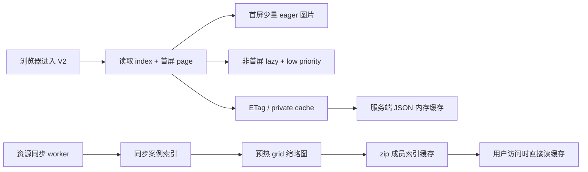

# V2 案例库二阶段速度优化开发文档

## 目标

在不引入 CDN、不改账号、扣费、生图中枢和历史权限的前提下，继续优化 Custom Media Agent 2.0 案例库的打开速度和重复访问速度。

本阶段建立在第 31 章已经完成的轻量索引、分页加载和高清缩略图分档之上，重点解决三类剩余瓶颈：

1. 首屏同时请求的缩略图仍然偏多。
2. `/templates/index` 和 `/templates/page` 每次进入都会重新传输 JSON。
3. 新案例库同步后，用户首次访问仍可能承担缩略图生成成本。
4. 批量预热或首次缓存未命中时，服务端反复扫描同一个 GitHub 快照 zip。

## 边界

- 不改 V1 生图、V2 生图、Claude Code 中枢、Template Lock、上传素材融合和 provider 选择。
- 不改 Veyra 登录、账号、扣费、历史可见性和管理员权限。
- 不改案例库来源解析逻辑，不改变上游 GitHub 同步语义。
- 不引入 CDN，所有优化先在现有 VPS 和浏览器缓存能力内完成。
- 旧 `/api/v2/templates`、旧 `/api/v2/case-thumbnails/{path}` 保持兼容。

## 方案总览



## 第四章：第三阶段本地可做优化

二阶段完成后，案例库仍有两个不依赖 CDN、带宽或新基础设施的优化点：

1. 服务端内存缓存：ETag 命中前不再重复序列化同一页 JSON。
2. 前端下一页预取：首屏渲染后，后台预取下一页 JSON，让用户点击“加载更多”时直接复用。
3. zip 成员索引缓存：读取缩略图原图时，不再对同一份快照 zip 反复 `namelist()` 扫描。
4. 缩略图 URL 版本化：在 `grid/preview` 缩略图 URL 上追加案例 `index_version`，让长期浏览器缓存随上游版本自然失效。

### 服务端内存缓存

缓存对象：

```text
template:index:{index_version}
template:page:{index_version}:{category}:{use_case}:{facet}:{cursor}:{limit}
```

缓存内容：

```text
body bytes
etag
headers
```

缓存策略：

- 按 `index_version` 自动隔离。案例库同步后版本变更，旧缓存自然失效。
- 缓存上限控制在较小范围，避免长期运行占用过多内存。
- 只缓存案例库模板接口，不缓存账号、历史、扣费、生图结果。

### 前端下一页预取

触发时机：

- 默认案例页加载成功后，如果 `has_more=true`，后台预取下一页 JSON。
- V2 首次初始化通过并行请求拿到首屏 page 后，也会立即触发下一页预取。
- 用户切换 facet 后，清空旧预取并按新 facet 预取。
- 搜索模式不预取，因为搜索结果是本地一次性列表。

复用策略：

- 用户点击“加载更多案例”时，如果预取 key 与当前 `next_cursor/facet/limit` 一致，直接复用预取结果。
- 如果预取失败，点击时自动走普通请求重试。
- 只预取 JSON，不主动加载下一页图片，避免抢首屏图片带宽。

### zip 成员索引缓存

问题：

- 案例原图存放在 GitHub 快照 zip 中，路径通常类似 `repo-main/images/poster_case147/output.jpg`。
- 前端和索引只保存规范路径 `images/poster_case147/output.jpg`。
- 缩略图缓存未命中或批量预热时，每张图都需要在 zip 成员列表中找到真实路径。

优化：

- 按快照文件路径、修改时间和文件大小建立进程内成员索引。
- 索引中同时保存 zip 内完整路径和 `images/...` 规范路径。
- LRU 上限保持很小，当前只缓存最近 4 个快照，避免长期占用内存。
- 快照文件变化后，缓存 key 自动变化，不复用旧索引。

收益：

- 批量预热时，同一个快照只扫描一次成员列表。
- 用户首次访问尚未生成的缩略图时，连续请求多张图不会重复扫描 zip。
- 不改变 `/api/v2/case-assets/...` 和 `/api/v2/case-thumbnails/...` 的 URL、权限或响应格式。

### 缩略图 URL 版本化

现有缩略图响应使用：

```text
Cache-Control: public, max-age=31536000, immutable
```

这是合理的强缓存策略，但前提是 URL 必须能表达内容版本。否则当上游仓库同路径图片更新时，浏览器可能长期使用旧图片。

本阶段让 `PromptCaseSummary` 额外带出 `index_version`，前端生成：

```text
/api/v2/case-thumbnails/grid/images/.../output.jpg?v=<index_version>
/api/v2/case-thumbnails/preview/images/.../output.jpg?v=<index_version>
```

服务端缩略图缓存本身已经把 `index_version` 纳入文件 digest，因此这里主要解决浏览器和中间层缓存的版本识别问题。

## 第一章：首屏减重与图片加载优先级

### 桌面端

- 首屏案例页大小从 24 降为 16。
- 前 6 张案例图设为 `loading="eager"`、`fetchpriority="high"`。
- 其余案例图设为 `loading="lazy"`、`fetchpriority="low"`。
- 明确图片尺寸为 720x900，降低布局抖动。

### 移动端

- 首屏案例页大小从 16 降为 10。
- 前 4 张案例图设为 `loading="eager"`、`fetchpriority="high"`。
- 其余案例图设为 `loading="lazy"`、`fetchpriority="low"`。
- 明确图片尺寸为 720x900。

### 预期收益

3M 带宽下，首屏缩略图请求数减少约三分之一到二分之一；浏览器优先拉取可见区域图片，滚动区图片不再抢占首屏带宽。

## 第二章：案例索引与分页接口缓存协商

### 接口

以下接口增加 ETag 与私有缓存：

```text
GET /api/v2/templates/index
GET /api/v2/templates/page
```

响应头：

```text
ETag: "v2-templates-<sha1>"
Cache-Control: private, max-age=300, stale-while-revalidate=86400
Vary: Authorization, Cookie
```

当请求头 `If-None-Match` 命中时返回：

```text
304 Not Modified
```

### 设计说明

- 案例库内容对所有已登录用户相同，但接口经过 Veyra 登录门禁，因此使用 `private` 而不是 `public`。
- ETag 基于 JSON payload 生成，包含 `index_version`、筛选条件、分页 cursor 和结果内容。
- 浏览器重复进入时可以直接复用缓存；案例库 7 天才刷新一次时收益明显。

## 第三章：同步后缩略图预热

### 触发点

资源同步 worker 每次成功同步后，自动预热 `grid` 缩略图。

```text
python -m app.workers.resource_sync_worker --once --mode remote
```

同步成功后输出中增加：

```json
{
  "thumbnail_prewarm": {
    "variant": "grid",
    "attempted": 804,
    "succeeded": 804,
    "failed": 0
  }
}
```

### 配置

```text
V2_CASE_THUMBNAIL_PREWARM_ENABLED=true
V2_CASE_THUMBNAIL_PREWARM_VARIANT=grid
V2_CASE_THUMBNAIL_PREWARM_LIMIT=0
```

- `LIMIT=0` 表示预热全部案例。
- 默认只预热 `grid`，不预热 `preview`，避免无谓占用磁盘和带宽。

### 手动预热

支持在 VPS 上单独执行：

```text
python -m app.workers.resource_sync_worker --once --mode auto --prewarm-only
```

该模式不重新同步案例库，只基于当前索引预热缩略图。

## 测试计划

### 后端

- `/templates/index` 返回 ETag 和 Cache-Control。
- `/templates/index` 使用 `If-None-Match` 命中时返回 304。
- `/templates/page` 返回 ETag，且不同分页/筛选产生不同 ETag。
- 缩略图预热函数能从案例 preview URL 提取资产路径，并调用 `grid` 预热。
- 模板接口重复请求能命中服务端内存缓存，且 `If-None-Match` 仍返回 304。
- 同一快照 zip 连续读取多个案例资产时，只构建一次成员索引。

### 前端

- 桌面首屏请求 `/templates/page?limit=16`。
- 移动首屏请求 `/templates/page?limit=10`。
- 案例卡片图片包含 `loading`、`decoding`、`fetchPriority`、`width`、`height`。
- 默认浏览模式加载成功后会预取下一页 JSON；点击加载更多优先复用预取。
- 首次 V2 初始化后也会触发下一页 JSON 预取。
- 案例缩略图和预览图 URL 带 `index_version` 查询参数。
- 旧搜索模式仍保留本地分页渲染。

### 回归

```text
python -m pytest tests\test_v2_api.py tests\test_resource_provider_m2.py -q
python -m compileall app
node --check src_skeleton/app/static/app.js
node --check src_skeleton/app/mobile_static/mobile.js
git diff --check
```

## 剩余优化评估

本轮已经完成的优化都满足三个条件：

1. 不增加带宽。
2. 不引入 CDN、对象存储或新服务。
3. 不改变账号、扣费、生图、历史权限和 V2 中枢链路。

当前已经直接落地：

- 首屏分页减重。
- 图片 eager/lazy/fetchPriority 分级。
- 模板 index/page 的 ETag 与 private cache。
- 模板 JSON 响应的服务端进程内缓存。
- 默认浏览模式下一页 JSON 预取与失败回退。
- 同步后 grid 缩略图预热。
- GitHub 快照 zip 成员索引缓存。
- 缩略图 URL 版本化，配合长期 immutable 缓存。

暂不继续落地的方向：

- Service Worker 离线缓存：能进一步减少重复访问，但会引入缓存生命周期、登录态隔离、旧资源清理和调试复杂度；现阶段 HTTP cache + ETag + 版本化 URL 已覆盖主要收益。
- Nginx 直出缩略图缓存文件：需要 VPS 路径映射和生产反向代理配置，属于部署侧优化，不是当前纯代码验证范围。
- CDN、对象存储、图片边缘缓存：明确属于外部条件，本阶段排除。
- 继续压低缩略图尺寸或质量：与“缩略图要能看清细节”的产品要求冲突，目前 `grid=720x900 quality=84` 是清晰度和带宽之间的折中。
- 预热 `preview` 高清图：会显著增加同步后的 CPU 和磁盘占用，列表首屏只需要 `grid`；高清预览保持按需生成更稳。
- V2 初始化渐进式拆分：可以让案例列表更早渲染，但会改动 V2 面板初始化时序，影响模型配置、历史、provider 状态的加载节奏，建议作为单独 UI 性能项目处理。

结论：在不增加外部条件、不过度扩大改造面的前提下，本阶段已经把当前明确、低风险、收益稳定的速度优化做完。后续如果仍觉得慢，应优先从生产部署侧检查 gzip/Nginx 缓存、磁盘 IO、VPS 出口带宽和 CDN/对象存储方案。

## 验收标准

1. 不再默认请求 `/templates/page?limit=24` 或 `/templates/page?limit=16` 作为桌面/移动首屏。
2. 桌面首屏加载 16 个案例，移动首屏加载 10 个案例。
3. 案例列表图片具备懒加载和优先级控制。
4. `/templates/index` 和 `/templates/page` 支持 ETag/304。
5. 资源同步 worker 支持同步后自动预热和 `--prewarm-only`。
6. 模板 JSON 响应支持服务端进程内缓存。
7. 前端支持下一页 JSON 预取并在加载更多时复用。
8. 缩略图原图读取支持快照 zip 成员索引缓存。
9. 案例缩略图 URL 带版本参数，配合长期缓存避免旧图滞留。
10. 相关单测、编译和前端语法检查通过。
